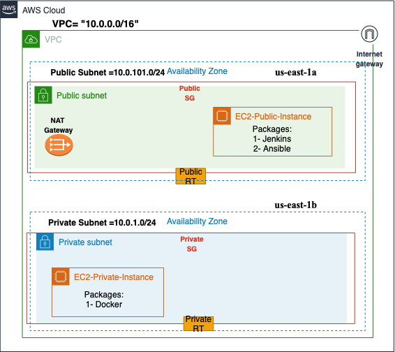

# Production-Ready-Terraform Assignment
This repository contains Terraform configuration files to set up a 2-tier architecture on AWS, including a VPC and compute resources. The infrastructure consists of public server, private application servers in separate subnets for better security and isolation. 

# Architecture Overview



VPC with separte network having public and private subnets with security group to control the traffic between the tiers. In our reference design, we have spread all the resources across two availability zones (AZ) to provide redundancy and resilience to cater for unexpected outages or scheduled system maintenance. Public subnet consist's of one server that we are using for CI purpose and the web server have been created on private subnet that we are using for running the artifacts.

# Remote Backend
 Created S3 bucket to store the .tfstate file in the remote backend with versioning enabled for backing up .tfstate file
 
# Set up
Install AWS CLI - https://docs.aws.amazon.com/cli/latest/userguide/getting-started-quickstart.html 
 
Install Terraform

Clone this repository
```
git clone https://github.com/hadainn/ee-assignment.git
```
Changes aws profile 
```
provider "aws" {
  region  = "us-east-1"
  profile = "default"  
  ## AWS Credentials Profile (profile = "default") configured on your local desktop terminal
}
```

Initialize project

```
cd ee-assignment/prod
terraform init
```
Valdiate terraform confguration

```
terraform validate
```
To see the plan of the execution

```
terraform plan
```
To deploy the terraform code

```
terraform apply 
```
Type yes, and it will prompt you for approval

```
terraform destroy
```
For de-provision 

# Enhancement of current code
We can also modularize this code with add-on components mentioned below.

1- Terraform Component Isolation

2- GitOps for Terraform code

3- Terraform directory structure

4- Adding Private subnet for database layer 

5- Adding Bastion host

6- Adding Load Balancer

7- Adding Autoscaling Group

8- Monitoring & Alert


